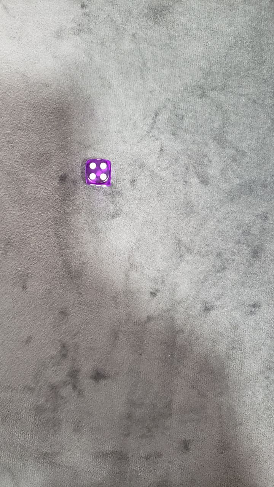
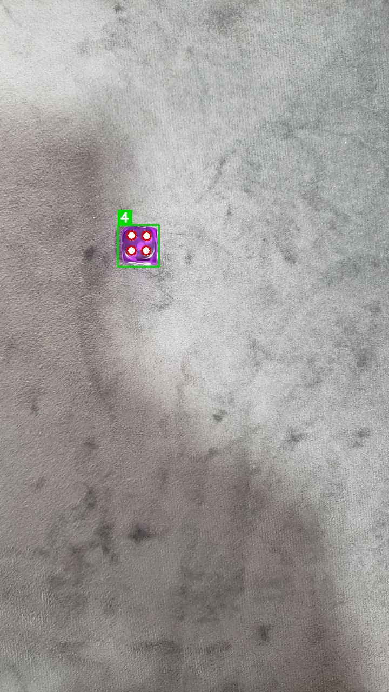
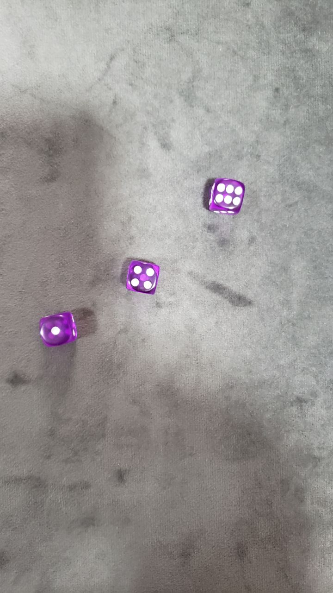
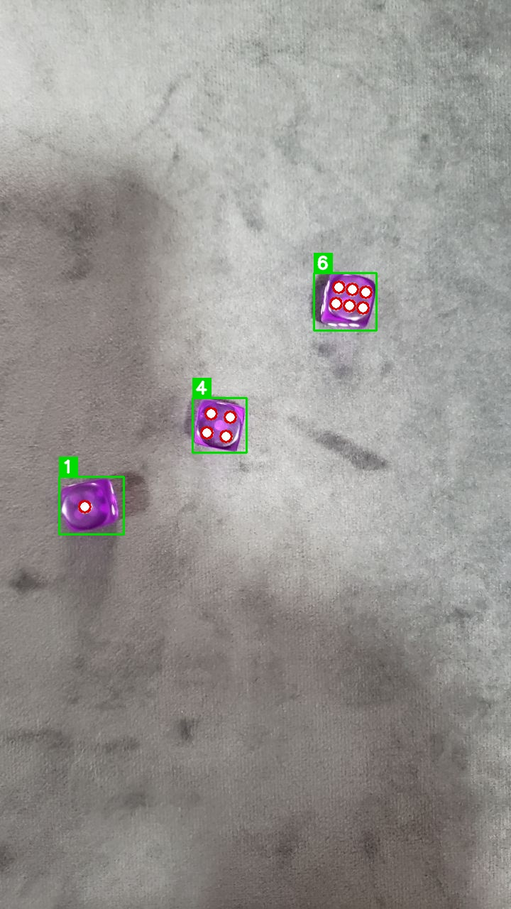

# dice-vision-counter

Sistema de visão computacional que detecta dados em imagens e soma automaticamente os valores das faces visíveis, construído com Python e OpenCV — sem machine learning.

---

## Como funciona

O pipeline percorre cinco etapas para cada imagem:

```
Imagem → HSV → Máscara roxa → Contornos → SimpleBlobDetector → Soma
```

1. **Segmentação por cor** — converte a imagem para o espaço HSV e isola apenas os pixels roxos dos dados
2. **Detecção de contornos** — encontra as regiões dos dados na máscara binária
3. **Recorte (ROI)** — extrai a região de cada dado individualmente
4. **Contagem de pips** — aplica `SimpleBlobDetector` filtrando por circularidade, inércia e convexidade para contar apenas os pontos brancos reais
5. **Soma** — acumula o valor de todos os dados na imagem

---

## Resultado

| Original | Detectado |
|:--------:|:---------:|
|  |  |
|  |  |

O sistema delimita cada dado com um bounding box verde, marca cada pip com um círculo vermelho e exibe a contagem no canto superior esquerdo.

```
=== img1.jpg ===  → 3 dados | soma: 11
=== img2.jpg ===  → 1 dado  | soma: 4
=== img3.jpg ===  → 4 dados | soma: 14
=== img4.jpg ===  → 4 dados | soma: 8
```

---

## Tecnologias

- Python 3.x
- OpenCV 4.13
- NumPy 2.4

---

## Estrutura

```
dice-vision-counter/
├── data/
│   └── raw/          # imagens de entrada
├── src/
│   ├── detector.py   # pipeline de detecção
│   └── main.py       # entrada: varre o diretório e gera relatório
└── requirements.txt
```

---

## Como executar

```bash
# clone o repositório
git clone https://github.com/Rodrigo-RRC/dice-vision-counter.git
cd dice-vision-counter

# crie e ative o ambiente virtual
python -m venv .venv
.venv\Scripts\activate      # Windows
# source .venv/bin/activate  # Linux/macOS

# instale as dependências
pip install -r requirements.txt

# execute
python src/main.py
```

---

## Limitações conhecidas

- Otimizado para dados roxos translúcidos sobre fundo neutro
- Iluminação muito intensa pode saturar um pip e dificultar a detecção
- Dados muito inclinados (>45°) podem ter o bounding rect distorcido

---

## Próximos passos

- [ ] Suporte a dados de outras cores
- [ ] Detecção robusta a variações de iluminação
- [ ] Interface visual com anotações sobre a imagem original
